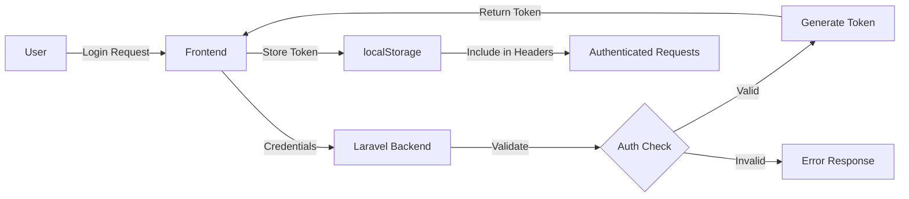

<div align="center">

# 🎨 Neverland Studio Portfolio

### Modern Full-Stack Portfolio & Admin Dashboard Platform

[](https://react.dev)
[](https://www.typescriptlang.org)
[](https://laravel.com)
[](https://tailwindcss.com)
[](https://vite.dev)
[](https://www.docker.com)

[](LICENSE)
[](docs/CONTRIBUTING.md)
[](https://prettier.io/)
[](docs/PRODUCTION_READY.md)

**Enterprise-grade portfolio platform with powerful admin dashboard, real-time analytics, and comprehensive security controls**

🌐 **Live Demo**: [portfolio.neverlandstudio.my.id](https://portfolio.neverlandstudio.my.id)

[✨ Features](#-key-features) • [🚀 Quick Start](#-quick-start) • [📚 Documentation](#-documentation) • [🐳 Deploy](docs/CLOUDFLARE_TUNNEL_DEPLOYMENT.md) • [🐛 Report Bug](https://github.com/MuhammadIsakiPrananda/neverland-studio-portfolio/issues)

</div>

---

## 🎯 Production Ready!

This project is **production-ready** and deployed at **[portfolio.neverlandstudio.my.id](https://portfolio.neverlandstudio.my.id)** using Cloudflare Tunnel.

- ✅ **Cloudflare Tunnel Setup** - No SSL configuration needed
- ✅ **Real-time Analytics** - Live dashboard with 5-second updates
- ✅ **Docker Production Ready** - One-command deployment
- ✅ **Complete Documentation** - Step-by-step guides

📖 **[Quick Deploy Guide](docs/CLOUDFLARE_TUNNEL_DEPLOYMENT.md)** | 📋 **[Production Checklist](docs/PRODUCTION_READY.md)** | 📚 **[All Documentation](docs/)**

---

## 📋 Table of Contents

<details>
<summary>Click to expand</summary>

- [✨ Key Features](#-key-features)
- [🛠️ Tech Stack](#️-tech-stack)
- [📦 Prerequisites](#-prerequisites)
- [🚀 Quick Start](#-quick-start)
  - [Local Development](#local-development)
  - [Docker Deployment](#docker-deployment)
- [📁 Project Structure](#-project-structure)
- [⚙️ Configuration](#️-configuration)
- [🔐 Authentication](#-authentication)
- [📊 Admin Dashboard](#-admin-dashboard)
- [🧪 Testing](#-testing)
- [🚢 Deployment](#-deployment)
- [📝 API Documentation](#-api-documentation)
- [🔧 Troubleshooting](#-troubleshooting)
- [🤝 Contributing](#-contributing)
- [📄 License](#-license)
- [💬 Support](#-support)

</details>

---

## ✨ Key Features

<table>
<tr>
<td width="50%">

### 🎯 Frontend Portfolio

- 🎨 **Modern Design** - Responsive UI with smooth animations
- 🌐 **Multi-language** - English & Indonesian support
- 🌓 **Theme Toggle** - Dark/Light mode with persistence
- 📱 **Mobile-First** - Optimized for all screen sizes
- 🔐 **OAuth 2.0** - Google & GitHub authentication
- ✉️ **Contact Forms** - Newsletter & consultation requests
- 🚀 **Lightning Fast** - Vite + React for optimal performance

</td>
<td width="50%">

### 📊 Admin Dashboard

- 👥 **User Management** - CRUD operations with verification
- 📈 **Real-time Analytics** - Live statistics & monitoring
- 🔒 **Security Controls** - Session management & audit logs
- 📧 **Newsletter System** - Subscriber management
- 💼 **Project Portfolio** - Dynamic content management
- 🎫 **Consultation Tracking** - Lead management system
- 🔔 **Activity Logging** - Complete audit trail

</td>
</tr>
</table>

### 🛡️ Security & Performance

<table>
<tr>
<td>

**🔐 Authentication**
- Sanctum token-based auth
- OAuth 2.0 integration
- CSRF protection
- Rate limiting
- Email verification

</td>
<td>

**🚀 Performance**
- Server-side rendering
- Code splitting
- Lazy loading
- Image optimization
- CDN-ready

</td>
<td>

**🔒 Security**
- XSS protection
- SQL injection prevention
- Secure headers
- Input validation
- Encrypted sessions

</td>
</tr>
</table>

---

## 🛠️ Tech Stack

### Frontend
```
⚛️  React 18.3           - UI library with hooks
📘 TypeScript 5.6        - Type-safe JavaScript
⚡ Vite 6.0              - Next-gen build tool
🎨 Tailwind CSS 3.4      - Utility-first CSS
🔄 React Router 7.1      - Client-side routing
📡 Axios                 - HTTP client
🎭 Framer Motion         - Animation library
```

### Backend
```
🐘 PHP 8.3               - Programming language
🎯 Laravel 11.x          - PHP framework
🔐 Sanctum               - API authentication
🗄️  MySQL 8.0 / SQLite   - Database systems
📨 Mailtrap / SMTP       - Email services
🔑 Socialite             - OAuth provider
```

### DevOps & Tools
```
🐳 Docker + Compose      - Containerization
🌐 Nginx                 - Web server
📦 Composer              - PHP dependencies
📦 npm/pnpm              - Node dependencies
🔧 ESLint + Prettier     - Code formatting
🧪 PHPUnit + Vitest      - Testing frameworks
```

---

## 📦 Prerequisites

Before you begin, ensure you have the following installed:

| Tool | Minimum Version | Purpose |
|------|----------------|---------|
| 🐘 **PHP** | 8.2+ | Backend runtime |
| 🟢 **Node.js** | 20+ | Frontend tooling |
| 🎼 **Composer** | 2.x | PHP package manager |
| 🗄️ **MySQL/SQLite** | 8.0+ / 3.x | Database |
| 🐳 **Docker** *(optional)* | 24+ | Container deployment |

> **💡 Tip:** Use [Laravel Herd](https://herd.laravel.com/) for instant PHP & MySQL setup on Windows/macOS

---

## 🚀 Quick Start

### Local Development

<details open>
<summary><b>📝 Step-by-Step Guide</b></summary>

#### 1️⃣ Clone the Repository

```bash
git clone https://github.com/MuhammadIsakiPrananda/neverland-studio-portfolio.git
cd neverland-studio-portfolio
```

#### 2️⃣ Backend Setup

```bash
cd backend

# Install PHP dependencies
composer install

# Copy environment file
cp .env.example .env

# Generate application key
php artisan key:generate

# Configure database in .env (choose SQLite or MySQL)
# For SQLite (easiest):
DB_CONNECTION=sqlite
DB_DATABASE=/absolute/path/to/database.sqlite

# For MySQL:
DB_CONNECTION=mysql
DB_HOST=127.0.0.1
DB_PORT=3306
DB_DATABASE=neverland_portfolio
DB_USERNAME=your_username
DB_PASSWORD=your_password

# Run migrations & seeders
php artisan migrate:fresh --seed

# Create admin user (optional)
php create_test_user.php

# Start backend server
php artisan serve
# Backend running at: http://127.0.0.1:8000
```

#### 3️⃣ Frontend Setup

```bash
cd ../

# Install Node dependencies
npm install
# or: pnpm install / yarn install

# Copy environment file
cp .env.example .env

# Configure API endpoint in .env
VITE_API_URL=http://127.0.0.1:8000

# Start development server
npm run dev
# Frontend running at: http://localhost:5173
```

#### 4️⃣ OAuth Configuration (Optional)

<details>
<summary>Click to view OAuth setup</summary>

**Google OAuth:**
1. Visit [Google Cloud Console](https://console.cloud.google.com/)
2. Create a new project → Enable Google+ API
3. Create OAuth credentials (Web application)
4. Add authorized redirect: `http://127.0.0.1:8000/api/auth/google/callback`

**GitHub OAuth:**
1. Visit [GitHub Developer Settings](https://github.com/settings/developers)
2. New OAuth App
3. Authorization callback: `http://127.0.0.1:8000/api/auth/github/callback`

**Update backend/.env:**
```bash
GOOGLE_CLIENT_ID=your_google_client_id
GOOGLE_CLIENT_SECRET=your_google_secret
GOOGLE_REDIRECT_URL=http://127.0.0.1:8000/api/auth/google/callback

GITHUB_CLIENT_ID=your_github_client_id
GITHUB_CLIENT_SECRET=your_github_secret
GITHUB_REDIRECT_URL=http://127.0.0.1:8000/api/auth/github/callback
```

See [OAUTH_SETUP.md](OAUTH_SETUP.md) for detailed instructions.

</details>

#### 5️⃣ Access the Application

- **Frontend Portfolio:** http://localhost:5173
- **Backend API:** http://127.0.0.1:8000
- **Admin Dashboard:** http://localhost:5173/dashboard

**Default Admin Credentials:**
```
Email: admin@example.com
Password: password
```

</details>

---

### Docker Deployment

<details>
<summary><b>🐳 Docker Compose Setup</b></summary>

#### Quick Deploy

```bash
# Build and start all services
docker-compose up -d --build

# View logs
docker-compose logs -f

# Stop services
docker-compose down
```

#### Service URLs

| Service | URL | Description |
|---------|-----|-------------|
| 🌐 **Frontend** | http://localhost:3000 | React application |
| 🔌 **Backend API** | http://localhost:8000 | Laravel API |
| 🗄️ **Database** | localhost:3306 | MySQL 8.0 |

#### Database Access

```bash
# Connect to MySQL container
docker-compose exec db mysql -u neverland_user -p

# Run migrations
docker-compose exec backend php artisan migrate --seed

# Create admin user
docker-compose exec backend php create_test_user.php
```

#### Production Configuration

```bash
# Update docker-compose.yml for production
# Set secure passwords and environment variables
# Enable HTTPS with SSL certificates

# See README.docker.md for detailed production setup
```

For complete Docker documentation, see [README.DOCKER.md](README.DOCKER.md)

</details>

---

## 📁 Project Structure

```
neverland-studio-portfolio/
│
├── 📱 Frontend (React + TypeScript)
│   ├── src/
│   │   ├── components/       # React components
│   │   │   ├── auth/         # Authentication UI
│   │   │   ├── common/       # Reusable components
│   │   │   ├── dashboard/    # Admin dashboard
│   │   │   ├── layout/       # Layout components
│   │   │   ├── modals/       # Modal dialogs
│   │   │   └── pages/        # Page components
│   │   ├── contexts/         # React contexts
│   │   ├── hooks/            # Custom hooks
│   │   ├── services/         # API services
│   │   │   ├── apiService.ts         # Base API client
│   │   │   ├── authService.ts        # Authentication
│   │   │   ├── dashboardService.ts   # Dashboard data
│   │   │   ├── userService.ts        # User management
│   │   │   └── analyticsService.ts   # Analytics
│   │   ├── types/            # TypeScript types
│   │   ├── utils/            # Utility functions
│   │   ├── App.tsx           # Root component
│   │   └── main.tsx          # Entry point
│   ├── public/               # Static assets
│   ├── index.html            # HTML template
│   ├── vite.config.ts        # Vite configuration
│   └── package.json          # Dependencies
│
├── 🐘 Backend (Laravel)
│   ├── app/
│   │   ├── Http/
│   │   │   └── Controllers/
│   │   │       └── Api/
│   │   │           ├── AuthController.php       # Authentication
│   │   │           ├── DashboardController.php  # Dashboard API
│   │   │           ├── UserController.php       # User CRUD
│   │   │           ├── SecurityController.php   # Security features
│   │   │           └── ...
│   │   └── Models/           # Eloquent models
│   ├── config/               # Configuration files
│   ├── database/
│   │   ├── migrations/       # Database migrations
│   │   └── seeders/          # Data seeders
│   ├── routes/
│   │   ├── api.php           # API routes
│   │   └── web.php           # Web routes
│   ├── storage/              # File storage
│   ├── tests/                # PHPUnit tests
│   ├── .env.example          # Environment template
│   ├── artisan               # CLI tool
│   └── composer.json         # Dependencies
│
├── 🐳 Docker
│   ├── docker-compose.yml    # Container orchestration
│   ├── Dockerfile.frontend   # Frontend image
│   ├── backend/Dockerfile    # Backend image
│   └── nginx/                # Nginx configuration
│
├── 📚 Documentation
│   ├── README.md             # This file
│   ├── README.DOCKER.md      # Docker guide
│   ├── OAUTH_SETUP.md        # OAuth configuration
│   ├── API.md                # API documentation
│   └── CONTRIBUTING.md       # Contribution guidelines
│
└── ⚙️ Configuration
    ├── .env.example          # Environment template
    ├── package.json          # Root dependencies
    ├── tsconfig.json         # TypeScript config
    ├── tailwind.config.js    # Tailwind config
    └── eslint.config.js      # ESLint config
```

---

## ⚙️ Configuration

### Environment Variables

<details>
<summary><b>📋 Backend Configuration (backend/.env)</b></summary>

```bash
# Application
APP_NAME="Neverland Studio"
APP_ENV=local
APP_KEY=base64:...
APP_DEBUG=true
APP_URL=http://127.0.0.1:8000
APP_TIMEZONE=Asia/Jakarta

# Frontend
FRONTEND_URL=http://localhost:5173

# Database (SQLite - recommended for development)
DB_CONNECTION=sqlite
DB_DATABASE=/absolute/path/to/database.sqlite

# Database (MySQL - recommended for production)
DB_CONNECTION=mysql
DB_HOST=127.0.0.1
DB_PORT=3306
DB_DATABASE=neverland_portfolio
DB_USERNAME=root
DB_PASSWORD=

# Session & Cache
SESSION_DRIVER=file
CACHE_STORE=file
QUEUE_CONNECTION=database

# Mail Configuration
MAIL_MAILER=smtp
MAIL_HOST=smtp.mailtrap.io
MAIL_PORT=2525
MAIL_USERNAME=your_username
MAIL_PASSWORD=your_password
MAIL_ENCRYPTION=tls
MAIL_FROM_ADDRESS="noreply@neverlandstudio.com"
MAIL_FROM_NAME="${APP_NAME}"

# OAuth Providers (optional)
GOOGLE_CLIENT_ID=
GOOGLE_CLIENT_SECRET=
GOOGLE_REDIRECT_URL="${APP_URL}/api/auth/google/callback"

GITHUB_CLIENT_ID=
GITHUB_CLIENT_SECRET=
GITHUB_REDIRECT_URL="${APP_URL}/api/auth/github/callback"

# Security
SANCTUM_STATEFUL_DOMAINS=localhost,127.0.0.1,localhost:5173
SESSION_DOMAIN=127.0.0.1
```

</details>

<details>
<summary><b>📋 Frontend Configuration (.env)</b></summary>

```bash
# API Configuration
VITE_API_URL=http://127.0.0.1:8000

# OAuth URLs
VITE_GOOGLE_AUTH_URL=http://127.0.0.1:8000/api/auth/google
VITE_GITHUB_AUTH_URL=http://127.0.0.1:8000/api/auth/github

# Application
VITE_APP_NAME="Neverland Studio"
VITE_APP_VERSION="1.5.0"

# Feature Flags
VITE_ENABLE_ANALYTICS=true
VITE_ENABLE_OAUTH=true
```

</details>

### Database Configuration

**Option 1: SQLite (Recommended for Development)**
```bash
# Quick and easy - no server required
DB_CONNECTION=sqlite
DB_DATABASE=/absolute/path/to/database.sqlite

# Create database file
touch backend/database/database.sqlite
```

**Option 2: MySQL (Recommended for Production)**
```bash
# Create database
mysql -u root -p
CREATE DATABASE neverland_portfolio CHARACTER SET utf8mb4 COLLATE utf8mb4_unicode_ci;

# Update .env
DB_CONNECTION=mysql
DB_HOST=127.0.0.1
DB_PORT=3306
DB_DATABASE=neverland_portfolio
DB_USERNAME=root
DB_PASSWORD=your_password
```

---

## 🔐 Authentication

### Authentication Flow



### Available Authentication Methods

<table>
<tr>
<td width="33%">

**📧 Email/Password**
- Traditional login
- Registration with validation
- Email verification
- Password reset

</td>
<td width="33%">

**🔑 OAuth 2.0**
- Google Sign-In
- GitHub Sign-In
- Automatic account creation
- Secure token exchange

</td>
<td width="34%">

**🛡️ API Authentication**
- Sanctum tokens
- CSRF protection
- Rate limiting
- Session management

</td>
</tr>
</table>

### Session Management

- **Token Storage:** Secure `localStorage` with encryption
- **Expiration:** 2 hours default (configurable)
- **Refresh:** Automatic token refresh
- **Logout:** Token revocation on all devices
- **Multi-device:** Manage active sessions from dashboard

### Security Features

✅ Password hashing with bcrypt  
✅ CSRF token validation  
✅ Rate limiting (60 req/min public, 120 req/min auth)  
✅ Email verification required for sensitive operations  
✅ Two-factor authentication (coming soon)  
✅ Login history tracking  
✅ Suspicious activity detection  

See [OAUTH_SETUP.md](OAUTH_SETUP.md) for OAuth configuration details.

---

## 📊 Admin Dashboard

### Dashboard Overview

The admin dashboard provides comprehensive management capabilities with real-time monitoring:

<table>
<tr>
<td width="50%">

### 📈 Analytics & Monitoring

- **Real-time Statistics**
  - Active users
  - Total registrations
  - Newsletter subscribers
  - Consultation requests
  - Project views
  
- **Activity Logs**
  - User actions
  - System events
  - Security alerts
  - API usage

- **Performance Metrics**
  - Response times
  - Database size
  - Error rates
  - Uptime monitoring

</td>
<td width="50%">

### 🛠️ Management Tools

- **User Management**
  - CRUD operations
  - Role assignment
  - Email verification status
  - Account suspension
  - Bulk actions
  
- **Content Management**
  - Projects portfolio
  - Newsletter campaigns
  - Consultation tracking
  - Contact form responses

- **Security Controls**
  - Active sessions
  - Login history
  - Password management
  - Access logs

</td>
</tr>
</table>

### Dashboard Features

| Feature | Description | Status |
|---------|-------------|--------|
| 👥 **User Management** | Complete CRUD with search, filter, pagination | ✅ Ready |
| 📧 **Newsletter System** | Subscriber management, bulk operations | ✅ Ready |
| 💼 **Project Portfolio** | Dynamic content management | ✅ Ready |
| 🎫 **Consultation Tracking** | Lead management with status tracking | ✅ Ready |
| 📊 **Real-time Analytics** | Live statistics with auto-refresh | ✅ Ready |
| 🔒 **Session Management** | Multi-device session control | ✅ Ready |
| 📋 **Activity Logging** | Complete audit trail | ✅ Ready |
| 🔔 **Notifications** | Real-time alerts (in-app) | ✅ Ready |
| 📨 **Email Integration** | Mailtrap/SMTP support | ✅ Ready |
| 🔐 **2FA Authentication** | Two-factor auth | 🚧 Planned |

### Access Control

- **Admin Panel:** `/dashboard`
- **Authentication:** Required with admin role
- **Permissions:** Role-based access control (RBAC)
- **Session Timeout:** 2 hours (configurable)

### Real-time Features

The dashboard uses a polling-based real-time system:

- **Auto-refresh Interval:** 30 seconds
- **Manual Refresh:** Available for all tables
- **Connection Status:** Visual indicator
- **Error Handling:** Automatic retry with exponential backoff

---

## 🧪 Testing

### Backend Testing (PHPUnit)

```bash
cd backend

# Run all tests
php artisan test

# Run specific test suite
php artisan test --testsuite=Feature
php artisan test --testsuite=Unit

# Run with coverage
php artisan test --coverage

# Run specific test file
php artisan test tests/Feature/AuthTest.php

# Watch mode
php artisan test --watch
```

### Frontend Testing (Vitest)

```bash
# Run all tests
npm run test

# Watch mode
npm run test:watch

# Coverage report
npm run test:coverage

# UI mode
npm run test:ui
```

### Test Structure

```
backend/tests/
├── Feature/              # Integration tests
│   ├── AuthTest.php
│   ├── UserManagementTest.php
│   └── DashboardTest.php
└── Unit/                 # Unit tests
    ├── Models/
    └── Services/

src/tests/
├── components/           # Component tests
├── hooks/                # Hook tests
└── services/             # Service tests
```

### Writing Tests

**Backend Example:**
```php
public function test_user_can_login()
{
    $user = User::factory()->create([
        'email' => 'test@example.com',
        'password' => bcrypt('password'),
    ]);

    $response = $this->postJson('/api/auth/login', [
        'email' => 'test@example.com',
        'password' => 'password',
    ]);

    $response->assertStatus(200)
             ->assertJsonStructure(['token', 'user']);
}
```

**Frontend Example:**
```typescript
import { describe, it, expect } from 'vitest';
import { render, screen } from '@testing-library/react';
import LoginForm from '@/components/auth/LoginForm';

describe('LoginForm', () => {
  it('renders login form correctly', () => {
    render(<LoginForm />);
    expect(screen.getByLabelText(/email/i)).toBeInTheDocument();
    expect(screen.getByLabelText(/password/i)).toBeInTheDocument();
  });
});
```

---

## 🚢 Deployment

### Production Checklist

<details>
<summary><b>✅ Pre-Deployment Steps</b></summary>

- [ ] **Environment Configuration**
  - [ ] Set `APP_ENV=production` in backend/.env
  - [ ] Set `APP_DEBUG=false`
  - [ ] Generate new `APP_KEY`
  - [ ] Configure production database
  - [ ] Set secure `SESSION_DOMAIN`
  - [ ] Update `FRONTEND_URL` and `APP_URL`
  
- [ ] **Security**
  - [ ] Enable HTTPS/SSL
  - [ ] Configure CORS properly
  - [ ] Set strong database passwords
  - [ ] Enable rate limiting
  - [ ] Configure firewall rules
  - [ ] Set up fail2ban (optional)
  
- [ ] **Performance**
  - [ ] Enable caching (`php artisan config:cache`)
  - [ ] Optimize routes (`php artisan route:cache`)
  - [ ] Compile views (`php artisan view:cache`)
  - [ ] Optimize autoloader (`composer install --optimize-autoloader --no-dev`)
  - [ ] Enable production build for frontend (`npm run build`)
  
- [ ] **Database**
  - [ ] Run migrations (`php artisan migrate --force`)
  - [ ] Backup database
  - [ ] Set up automated backups
  - [ ] Optimize database indexes
  
- [ ] **Monitoring**
  - [ ] Configure error logging
  - [ ] Set up application monitoring
  - [ ] Configure uptime monitoring
  - [ ] Set up log rotation
  - [ ] Enable Laravel Telescope (optional)

</details>

### Deployment Options

<details open>
<summary><b>🚀 Recommended Platforms</b></summary>

#### Option 1: VPS Deployment (DigitalOcean, AWS, Linode)

```bash
# 1. Install dependencies
sudo apt update
sudo apt install nginx mysql-server php8.3-fpm php8.3-mysql composer nodejs npm

# 2. Clone repository
git clone https://github.com/your-username/neverland-studio-portfolio.git
cd neverland-studio-portfolio

# 3. Backend setup
cd backend
composer install --optimize-autoloader --no-dev
cp .env.example .env
php artisan key:generate
php artisan migrate --force
php artisan config:cache
php artisan route:cache
php artisan view:cache

# 4. Frontend setup
cd ..
npm ci --production
npm run build

# 5. Configure Nginx (see nginx/conf.d/default.conf)
sudo ln -s /path/to/nginx/config /etc/nginx/sites-enabled/
sudo nginx -t
sudo systemctl reload nginx

# 6. Set permissions
sudo chown -R www-data:www-data backend/storage backend/bootstrap/cache
sudo chmod -R 775 backend/storage backend/bootstrap/cache
```

#### Option 2: Docker Production

```bash
# Use production docker-compose file
docker-compose -f docker-compose.prod.yml up -d

# See README.DOCKER.md for detailed production setup
```

#### Option 3: Laravel Forge

1. Connect your VPS to Laravel Forge
2. Create new site pointing to your repository
3. Configure environment variables
4. Deploy via Forge dashboard

#### Option 4: Shared Hosting

See [DEPLOYMENT.md](DEPLOYMENT.md) for shared hosting setup instructions.

</details>

### SSL/HTTPS Configuration

<details>
<summary><b>🔒 Enable SSL with Let's Encrypt</b></summary>

```bash
# Install Certbot
sudo apt install certbot python3-certbot-nginx

# Obtain certificate
sudo certbot --nginx -d yourdomain.com -d www.yourdomain.com

# Auto-renewal (crontab)
0 3 * * * certbot renew --quiet
```

Update `.env` files:
```bash
# Backend
APP_URL=https://yourdomain.com
SESSION_SECURE_COOKIE=true

# Frontend
VITE_API_URL=https://yourdomain.com
```

</details>

### Database Backup

```bash
# MySQL backup script
mysqldump -u username -p neverland_portfolio > backup_$(date +%Y%m%d).sql

# Automated backup (crontab)
0 2 * * * /path/to/backup-script.sh

# Restore backup
mysql -u username -p neverland_portfolio < backup_20240101.sql
```

---

## 📝 API Documentation

### Base URL

```
Development: http://127.0.0.1:8000/api
Production:  https://yourdomain.com/api
```

### Authentication

All protected endpoints require authentication token in headers:

```http
Authorization: Bearer {your_access_token}
```

### Endpoints Overview

<details>
<summary><b>🔐 Authentication</b></summary>

#### Login
```http
POST /api/auth/login
Content-Type: application/json

{
  "email": "user@example.com",
  "password": "password123"
}

Response: 200 OK
{
  "success": true,
  "token": "1|abcd...",
  "user": { ... }
}
```

#### Register
```http
POST /api/auth/register
Content-Type: application/json

{
  "name": "John Doe",
  "email": "john@example.com",
  "password": "password123",
  "password_confirmation": "password123"
}
```

#### OAuth Login
```http
GET /api/auth/google
GET /api/auth/github
GET /api/auth/{provider}/callback
```

#### Logout
```http
POST /api/auth/logout
Authorization: Bearer {token}
```

#### Get Current User
```http
GET /api/auth/user
Authorization: Bearer {token}
```

</details>

<details>
<summary><b>👥 User Management</b></summary>

#### Get Users (Paginated)
```http
GET /api/admin/users?page=1&per_page=15&search=john
Authorization: Bearer {token}

Response: 200 OK
{
  "success": true,
  "data": [...],
  "pagination": {
    "current_page": 1,
    "last_page": 5,
    "per_page": 15,
    "total": 73
  }
}
```

#### Create User
```http
POST /api/admin/users
Authorization: Bearer {token}
Content-Type: application/json

{
  "name": "John Doe",
  "email": "john@example.com",
  "password": "password123",
  "phone": "081234567890"
}
```

#### Update User
```http
PUT /api/admin/users/{id}
Authorization: Bearer {token}
Content-Type: application/json

{
  "name": "John Doe Updated",
  "email": "john@example.com",
  "email_verified_at": "2024-01-01 00:00:00"
}
```

#### Delete User
```http
DELETE /api/admin/users/{id}
Authorization: Bearer {token}

Response: 200 OK
{
  "success": true,
  "message": "User deleted successfully"
}
```

</details>

<details>
<summary><b>📊 Dashboard & Analytics</b></summary>

#### Get Real-time Statistics
```http
GET /api/admin/realtime/stats
Authorization: Bearer {token}

Response: 200 OK
{
  "users": {
    "total": 150,
    "verified": 120,
    "active_now": 5
  },
  "consultations": {
    "total": 45,
    "pending": 10,
    "contacted": 15,
    "in_progress": 8,
    "completed": 12,
    "cancelled": 0
  },
  "projects": {
    "total": 25,
    "published": 20
  },
  "newsletters": {
    "subscribers": 350
  }
}
```

#### Get Activity Logs
```http
GET /api/admin/activity-logs?limit=50
Authorization: Bearer {token}
```

</details>

<details>
<summary><b>🔒 Security</b></summary>

#### Get Login History
```http
GET /api/security/login-history?limit=20
Authorization: Bearer {token}
```

#### Get Active Sessions
```http
GET /api/security/sessions
Authorization: Bearer {token}
```

#### Revoke Session
```http
DELETE /api/security/sessions/{id}
Authorization: Bearer {token}
```

#### Change Password
```http
POST /api/security/change-password
Authorization: Bearer {token}
Content-Type: application/json

{
  "current_password": "oldpassword",
  "new_password": "newpassword",
  "new_password_confirmation": "newpassword"
}
```

</details>

### Rate Limiting

| Endpoint Type | Rate Limit | Window |
|--------------|------------|--------|
| Public endpoints | 60 requests | per minute |
| Authenticated | 120 requests | per minute |
| Admin endpoints | 180 requests | per minute |

### Error Responses

```json
{
  "success": false,
  "message": "Error description",
  "errors": {
    "field": ["Error details"]
  }
}
```

**Common Status Codes:**
- `200 OK` - Success
- `201 Created` - Resource created
- `400 Bad Request` - Validation error
- `401 Unauthorized` - Authentication required
- `403 Forbidden` - Insufficient permissions
- `404 Not Found` - Resource not found
- `429 Too Many Requests` - Rate limit exceeded
- `500 Internal Server Error` - Server error

For complete API documentation, see [API.md](API.md)

---

## 🔧 Troubleshooting

<details>
<summary><b>❌ Common Issues & Solutions</b></summary>

### Issue: 500 Error on `/api/admin/realtime/stats`

**Symptom:** Backend returning 500 Internal Server Error

**Cause:** Database schema mismatch or missing tables

**Solution:**
```bash
# Check migration status
php artisan migrate:status

# Re-run migrations
php artisan migrate:fresh --seed

# Check error logs
tail -f backend/storage/logs/laravel.log
```

---

### Issue: Users Management infinite loop

**Symptom:** Console showing repeated "Fetching users..." and table not loading

**Cause:** Real-time subscription triggering fetchUsers() recursively

**Solution:**
Already fixed in DashboardUsers.tsx with:
- Direct state updates instead of fetch calls
- `isFetching` flag to prevent concurrent requests
- Conditional pagination updates

**Verify fix:**
```bash
# Check console for single fetch log
# Should see: 🔄 Fetching users... (only once)
```

---

### Issue: CORS errors in browser console

**Symptom:** 
```
Access to XMLHttpRequest at 'http://127.0.0.1:8000' has been blocked by CORS policy
```

**Solution:**
```bash
# backend/config/cors.php
'allowed_origins' => [
    'http://localhost:5173',
    'http://127.0.0.1:5173',
],

# backend/.env
SANCTUM_STATEFUL_DOMAINS=localhost,127.0.0.1,localhost:5173
SESSION_DOMAIN=127.0.0.1
```

---

### Issue: OAuth not working

**Symptom:** OAuth redirect fails or returns 500 error

**Solution:**
1. Verify OAuth credentials in `.env`
2. Check redirect URLs match exactly (http vs https)
3. Ensure Socialite package is installed:
   ```bash
   composer require laravel/socialite
   ```
4. See [OAUTH_SETUP.md](OAUTH_SETUP.md) for detailed setup

---

### Issue: Database connection failed

**Symptom:** 
```
SQLSTATE[HY000]: General error: 1 no such table
```

**Solution:**
```bash
# For SQLite: Create database file
touch backend/database/database.sqlite
chmod 664 backend/database/database.sqlite

# For MySQL: Check credentials
mysql -u username -p -e "SHOW DATABASES;"

# Run migrations
php artisan migrate:fresh --seed
```

---

### Issue: Frontend not connecting to backend

**Symptom:** Network errors or "Cannot reach server"

**Solution:**
1. Verify backend is running:
   ```bash
   # Should show PHP server running
   ps aux | grep artisan
   ```

2. Check `.env` API URL:
   ```bash
   # .env (frontend root)
   VITE_API_URL=http://127.0.0.1:8000
   ```

3. Use `127.0.0.1` instead of `localhost` for consistency

4. Restart both servers:
   ```bash
   # Terminal 1
   cd backend && php artisan serve
   
   # Terminal 2
   npm run dev
   ```

---

### Issue: Permission denied errors

**Symptom:**
```
The stream or file "storage/logs/laravel.log" could not be opened
```

**Solution:**
```bash
# Linux/Mac
chmod -R 775 backend/storage
chmod -R 775 backend/bootstrap/cache
chown -R $USER:www-data backend/storage backend/bootstrap/cache

# Windows (run as administrator)
icacls "backend\storage" /grant "Users:(OI)(CI)F" /T
icacls "backend\bootstrap\cache" /grant "Users:(OI)(CI)F" /T
```

---

### Issue: Vite build errors

**Symptom:**
```
Failed to resolve import "@/components/..."
```

**Solution:**
```bash
# Clear cache and reinstall
rm -rf node_modules package-lock.json
npm install

# Check tsconfig.json paths are correct
"paths": {
  "@/*": ["./src/*"]
}
```

---

### Issue: Email not sending

**Symptom:** Email verification or notifications not working

**Solution:**
```bash
# Check mail configuration in backend/.env
MAIL_MAILER=smtp
MAIL_HOST=smtp.mailtrap.io
MAIL_PORT=2525
MAIL_USERNAME=your_username
MAIL_PASSWORD=your_password

# Test email
php artisan tinker
Mail::raw('Test email', function($msg) {
    $msg->to('test@example.com')->subject('Test');
});
```

For Mailtrap setup, see their [integration guide](https://mailtrap.io/blog/laravel-send-email/)

</details>

<details>
<summary><b>🐛 Debug Mode</b></summary>

### Enable Debug Logging

**Backend:**
```bash
# backend/.env
APP_DEBUG=true
LOG_LEVEL=debug

# View logs
tail -f backend/storage/logs/laravel.log
```

**Frontend:**
```typescript
// Enable verbose API logging
// src/services/apiService.ts
axios.interceptors.response.use(
  response => {
    console.log('API Response:', response);
    return response;
  },
  error => {
    console.error('API Error:', error.response);
    return Promise.reject(error);
  }
);
```

</details>

### Getting Help

If you can't resolve an issue:

1. **Check Documentation:** Review [API.md](API.md), [OAUTH_SETUP.md](OAUTH_SETUP.md), [README.DOCKER.md](README.DOCKER.md)
2. **Search Issues:** Check [GitHub Issues](https://github.com/MuhammadIsakiPrananda/neverland-studio-portfolio/issues)
3. **Create Issue:** Open a new issue with:
   - Error messages/screenshots
   - Steps to reproduce
   - Environment details (OS, PHP version, Node version)
   - Relevant log files

---

## 🤝 Contributing

We welcome contributions! Please follow these guidelines:

### How to Contribute

<details open>
<summary><b>📝 Step-by-Step Process</b></summary>

1. **Fork the Repository**
   ```bash
   # Click "Fork" on GitHub
   git clone https://github.com/YOUR_USERNAME/neverland-studio-portfolio.git
   cd neverland-studio-portfolio
   ```

2. **Create Feature Branch**
   ```bash
   git checkout -b feature/amazing-feature
   # or
   git checkout -b bugfix/fix-issue-123
   ```

3. **Make Your Changes**
   - Write clean, documented code
   - Follow existing code style
   - Add tests for new features
   - Update documentation if needed

4. **Commit Changes**
   ```bash
   git add .
   git commit -m "feat: add amazing feature"
   # Follow Conventional Commits format
   ```

5. **Push to Branch**
   ```bash
   git push origin feature/amazing-feature
   ```

6. **Open Pull Request**
   - Go to GitHub and click "New Pull Request"
   - Provide clear description of changes
   - Link related issues
   - Wait for review

</details>

### Coding Standards

<table>
<tr>
<td width="50%">

**Frontend (TypeScript/React)**
- ✅ ESLint + Prettier
- ✅ TypeScript strict mode
- ✅ Functional components with hooks
- ✅ Proper prop types
- ✅ Meaningful component names
- ✅ CSS modules or Tailwind classes

</td>
<td width="50%">

**Backend (PHP/Laravel)**
- ✅ PSR-12 coding standard
- ✅ Type hints for all methods
- ✅ DocBlocks for public methods
- ✅ Eloquent ORM best practices
- ✅ Service pattern for business logic
- ✅ Form Requests for validation

</td>
</tr>
</table>

### Commit Message Format

Follow [Conventional Commits](https://www.conventionalcommits.org/):

```
<type>(<scope>): <subject>

[optional body]

[optional footer]
```

**Types:**
- `feat:` New feature
- `fix:` Bug fix
- `docs:` Documentation changes
- `style:` Code style changes (formatting)
- `refactor:` Code refactoring
- `test:` Adding or updating tests
- `chore:` Maintenance tasks

**Examples:**
```bash
feat(auth): add OAuth support for GitHub
fix(dashboard): resolve infinite loop in user management
docs(readme): update installation instructions
refactor(api): improve error handling
```

### Development Guidelines

- 🔍 **Code Review:** All PRs require review
- 🧪 **Testing:** Add tests for new features
- 📚 **Documentation:** Update docs for API changes
- ♻️ **Keep it Simple:** Follow KISS principle
- 🎯 **Atomic Commits:** One logical change per commit
- 🚫 **No Breaking Changes:** Maintain backward compatibility

For detailed guidelines, see [CONTRIBUTING.md](CONTRIBUTING.md)

---

## 📄 License

This project is licensed under the **MIT License**.

<details>
<summary><b>📜 View License</b></summary>

```
MIT License

Copyright (c) 2025 Neverland Studio

Permission is hereby granted, free of charge, to any person obtaining a copy
of this software and associated documentation files (the "Software"), to deal
in the Software without restriction, including without limitation the rights
to use, copy, modify, merge, publish, distribute, sublicense, and/or sell
copies of the Software, and to permit persons to whom the Software is
furnished to do so, subject to the following conditions:

The above copyright notice and this permission notice shall be included in all
copies or substantial portions of the Software.

THE SOFTWARE IS PROVIDED "AS IS", WITHOUT WARRANTY OF ANY KIND, EXPRESS OR
IMPLIED, INCLUDING BUT NOT LIMITED TO THE WARRANTIES OF MERCHANTABILITY,
FITNESS FOR A PARTICULAR PURPOSE AND NONINFRINGEMENT. IN NO EVENT SHALL THE
AUTHORS OR COPYRIGHT HOLDERS BE LIABLE FOR ANY CLAIM, DAMAGES OR OTHER
LIABILITY, WHETHER IN AN ACTION OF CONTRACT, TORT OR OTHERWISE, ARISING FROM,
OUT OF OR IN CONNECTION WITH THE SOFTWARE OR THE USE OR OTHER DEALINGS IN THE
SOFTWARE.
```

See [LICENSE](LICENSE) file for details.

</details>

---

## 💬 Support

### 📚 Resources

- 📖 **Documentation:** [All Docs](docs/)
- 🚀 **Production Guide:** [Cloudflare Tunnel Deployment](docs/CLOUDFLARE_TUNNEL_DEPLOYMENT.md)
- 🐳 **Docker Guide:** [Docker Setup](docs/README.DOCKER.md)
- 🔐 **OAuth Setup:** [OAuth Configuration](docs/OAUTH_SETUP.md)
- 📡 **API Docs:** [API Reference](docs/API.md)
- 🤝 **Contributing:** [Contributing Guide](docs/CONTRIBUTING.md)
- 🔒 **Security:** [Security Policy](docs/SECURITY.md)

### 🆘 Get Help

- 🐛 **Bug Reports:** [GitHub Issues](https://github.com/MuhammadIsakiPrananda/neverland-studio-portfolio/issues)
- 💡 **Feature Requests:** [GitHub Discussions](https://github.com/MuhammadIsakiPrananda/neverland-studio-portfolio/discussions)
- 📧 **Email:** support@neverlandstudio.com
- 💬 **Community:** [Discord Server](#) *(coming soon)*

### 🌐 Links

- 🏠 **Website:** https://neverlandstudio.com
- 🐙 **GitHub:** [@MuhammadIsakiPrananda](https://github.com/MuhammadIsakiPrananda)
- 📱 **LinkedIn:** [Muhammad Isaki Prananda](#)
- 🐦 **Twitter:** [@neverland_studio](#)

---

## 🎯 Roadmap

<details>
<summary><b>📅 Future Plans</b></summary>

### Version 2.0 (Planned - Q2 2025)
- [ ] 🔄 Real-time notifications with WebSockets
- [ ] 📊 Advanced analytics dashboard with charts
- [ ] 📁 File manager with cloud storage (S3/Cloudinary)
- [ ] 🌍 Multi-language admin panel (i18n)
- [ ] ✉️ Email templates management
- [ ] 👥 Advanced user roles & permissions (RBAC)
- [ ] ⚡ API rate limiting dashboard
- [ ] 💾 Automated database backups
- [ ] 📈 Performance monitoring (APM)
- [ ] 🔍 SEO optimization tools

### Version 1.5 (In Progress - Q1 2025)
- [x] 🐳 Docker production deployment
- [x] 👥 User management with email verification
- [x] 🔒 Session management
- [x] 📋 Activity logging
- [x] 🐛 Bug fixes (infinite loop, 500 errors)
- [ ] 🔐 Two-factor authentication (2FA)
- [ ] 📧 Email service integration (SendGrid/Mailgun)
- [ ] 💳 Payment gateway integration (Stripe/PayPal)
- [ ] 🌙 Theme customization system
- [ ] 🔔 Push notifications

### Version 1.0 (Released - December 2024)
- [x] ⚛️ React + TypeScript frontend
- [x] 🐘 Laravel 11.x backend
- [x] 🔐 OAuth authentication (Google/GitHub)
- [x] 📊 Admin dashboard
- [x] 👥 Basic user management
- [x] 📧 Newsletter system
- [x] 💼 Project portfolio
- [x] 📱 Responsive design
- [x] 🎨 Tailwind CSS styling
- [x] 🐳 Docker support

</details>

---

## 🙏 Acknowledgments

Special thanks to the amazing open-source community:

- ⚛️ **[React Team](https://react.dev)** - For the incredible UI library
- 🐘 **[Laravel Team](https://laravel.com)** - For the elegant PHP framework
- 🎨 **[Tailwind Labs](https://tailwindcss.com)** - For the utility-first CSS framework
- ⚡ **[Vite Team](https://vite.dev)** - For the lightning-fast build tool
- 🐳 **[Docker Inc.](https://www.docker.com)** - For containerization platform
- 📘 **[TypeScript Team](https://www.typescriptlang.org)** - For type safety
- 🔍 **[All Contributors](https://github.com/MuhammadIsakiPrananda/neverland-studio-portfolio/graphs/contributors)** - For making this project better

---

<div align="center">

### Made with ❤️ by [Muhammad Isaki Prananda](https://github.com/MuhammadIsakiPrananda)

⭐ **Star this repo** if you find it helpful!

[](https://github.com/MuhammadIsakiPrananda/neverland-studio-portfolio/stargazers)
[](https://github.com/MuhammadIsakiPrananda/neverland-studio-portfolio/network/members)
[](https://github.com/MuhammadIsakiPrananda/neverland-studio-portfolio/watchers)

[🌟 GitHub Repository](https://github.com/MuhammadIsakiPrananda/neverland-studio-portfolio) • [� Documentation](docs/) • [🚀 Deploy Guide](docs/CLOUDFLARE_TUNNEL_DEPLOYMENT.md) • [🐳 Docker](docs/README.DOCKER.md)

---

**Version 1.5.0** • Last Updated: December 2025

</div>
